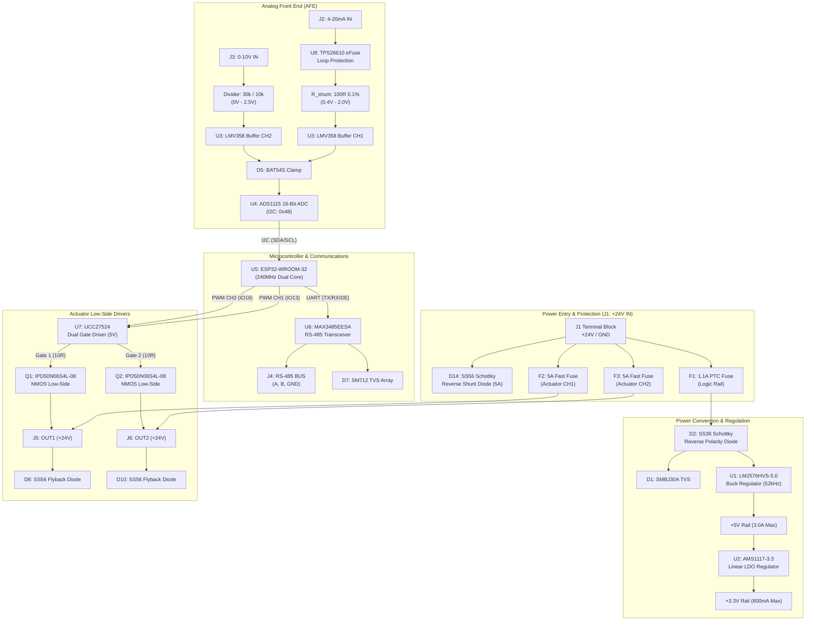

# MISACS Phase 3 — Functional Block Diagram and Signal Flow
**Revision:** Phase 3 Master Release Candidate  

```mermaid
graph TD
    subgraph PowerEntry ["Power Entry & Protection (J1: +24V IN)"]
        J1["J1 Terminal Block<br/>+24V / GND"] --> D14["D14: SS56 Schottky<br/>Reverse Shunt Diode (5A)"]
        J1 --> F1["F1: 1.1A PTC Fuse<br/>(Logic Rail)"]
        J1 --> F2["F2: 5A Fast Fuse<br/>(Actuator CH1)"]
        J1 --> F3["F3: 5A Fast Fuse<br/>(Actuator CH2)"]
    end

    subgraph PowerConversion ["Power Conversion & Regulation"]
        F1 --> D2["D2: SS36 Schottky<br/>Reverse Polarity Diode"]
        D2 --> D1["D1: SMBJ30A TVS"]
        D2 --> U1["U1: LM2576HVS-5.0<br/>Buck Regulator (52kHz)"]
        U1 --> Rail5V["+5V Rail (3.0A Max)"]
        Rail5V --> U2["U2: AMS1117-3.3<br/>Linear LDO Regulator"]
        U2 --> Rail3V3["+3.3V Rail (800mA Max)"]
    end

    subgraph AnalogFrontEnd ["Analog Front End (AFE)"]
        J2["J2: 4-20mA IN"] --> U8["U8: TPS26610 eFuse<br/>Loop Protection"]
        U8 --> Rshunt["R_shunt: 100R 0.1%<br/>(0.4V - 2.0V)"]
        Rshunt --> U3A["U3: LMV358 Buffer CH1"]
        
        J3["J3: 0-10V IN"] --> Rdiv["Divider: 30k / 10k<br/>(0V - 2.5V)"]
        Rdiv --> U3B["U3: LMV358 Buffer CH2"]

        U3A --> D5["D5: BAT54S Clamp"]
        U3B --> D5
        D5 --> U4["U4: ADS1115 16-Bit ADC<br/>(I2C: 0x48)"]
    end

    subgraph ControllerCore ["Microcontroller & Communications"]
        U5["U5: ESP32-WROOM-32<br/>(240MHz Dual Core)"]
        U4 -- "I2C (SDA/SCL)" --> U5
        U5 -- "UART (TX/RX/DE)" --> U6["U6: MAX3485EESA<br/>RS-485 Transceiver"]
        U6 --> J4["J4: RS-485 BUS<br/>(A, B, GND)"]
        U6 --> D7["D7: SM712 TVS Array"]
    end

    subgraph ActuatorOutputs ["Actuator Low-Side Drivers"]
        U5 -- "PWM CH1 (IO13)" --> U7["U7: UCC27524<br/>Dual Gate Driver (5V)"]
        U5 -- "PWM CH2 (IO16)" --> U7
        
        U7 -- "Gate 1 (10R)" --> Q1["Q1: IPD50N06S4L-08<br/>NMOS Low-Side"]
        U7 -- "Gate 2 (10R)" --> Q2["Q2: IPD50N06S4L-08<br/>NMOS Low-Side"]
        
        F2 --> J5["J5: OUT1 (+24V)"]
        Q1 --> J5
        J5 --> D8["D8: SS56 Flyback Diode"]
        
        F3 --> J6["J6: OUT2 (+24V)"]
        Q2 --> J6
        J6 --> D10["D10: SS56 Flyback Diode"]
    end
```
