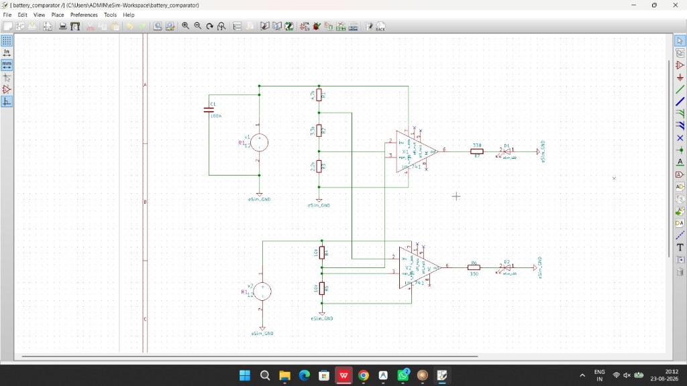
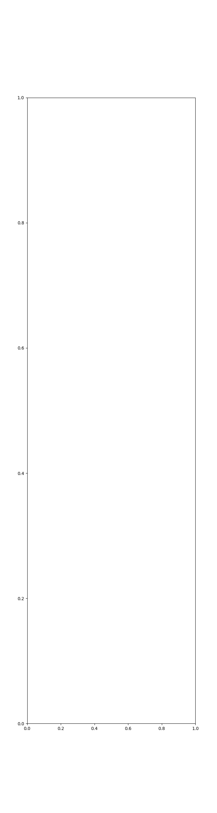
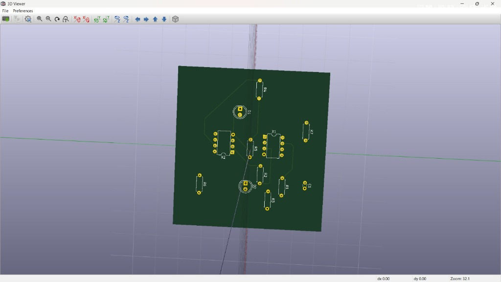

# Battery Over/Under-Voltage Window Comparator PCB Design

---

## Project Overview
In modern Battery Management Systems (BMS), maintaining battery cell voltages within a safe operational window is vital to prevent deep-discharge degradation or overcharge thermal runaway.

This project implements an **autonomous hardware-level Window Comparator** using dual precision **LM741 Operational Amplifiers**. It continuously senses the battery terminal voltage in real-time and provides immediate visual alerts through dedicated fault LEDs without requiring a microcontroller.

### Key Features:
- **Under-Voltage Indicator (Low Battery):** Red **LED 1** turns **ON** when battery voltage falls below 5.18 V.
- **Normal Operating Window (Safe Zone):** Both LEDs remain **OFF** while the battery voltage stays between 5.18 V and 12.94 V.
- **Over-Voltage Indicator (Over-Charge):** Red **LED 2** turns **ON** when battery voltage exceeds 12.94 V.
- **Decoupling Protection:** Integrated 100 nF high-frequency ceramic capacitor to suppress power rail switching transients.

---

## Circuit Schematic & Working
The schematic was designed in **eSim Eeschema** with complete ERC validation (0 Errors).

*Figure 1: Complete Schematic of the Battery Window Comparator in eSim Eeschema.*

### Mathematical Formulations:
#### 1. Reference Voltage Ladder (V_CC = 12V):
- R_total = R1 (4.7k) + R2 (3.3k) + R3 (2.2k) = 10.2k Ohm
- V_high_ref = 12V * (3.3k + 2.2k) / 10.2k = 6.47 V
- V_low_ref  = 12V * 2.2k / 10.2k = 2.59 V

#### 2. Battery Voltage Sense Divider (R4 = R5 = 10k):
- V_sense = V_battery * 10k / (10k + 10k) = 0.50 * V_battery

#### 3. Threshold Mapping:
- Low-Battery Cutoff: 5.18 V
- Over-Voltage Cutoff: 12.94 V

---

## Operational Truth Table
| Battery Voltage (V_batt) | Scaled Sense (V_sense) | Comparator U1 (Low-Batt) | Comparator U2 (Over-Volt) | LED 1 (Low-Batt) | LED 2 (Over-Volt) | Operating Status |
| :---: | :---: | :---: | :---: | :---: | :---: | :---: |
| **< 5.18 V** | < 2.59 V | **HIGH (~11.5V)** | LOW (0V) | **ON** | OFF | **Under-Voltage Fault** |
| **5.18 V - 12.94 V** | 2.59 V - 6.47 V | LOW (0V) | LOW (0V) | OFF | OFF | **Normal (Safe Window)** |
| **> 12.94 V** | > 6.47 V | LOW (0V) | **HIGH (~11.5V)** | OFF | **ON** | **Over-Voltage Fault** |

---

## Circuit Simulation (Ngspice)
Transient analysis was performed using **Ngspice 35** integrated within eSim with verified SPICE subcircuits (lm741.sub).

*Figure 2: Ngspice Simulation Output (2008 data points computed without convergence errors).*

---

## Bill of Materials (BOM) & Footprints
| RefDes | Qty | Value / Component | Function | KiCad Footprint (CvPcb) |
| :--- | :---: | :--- | :--- | :--- |
| **X1, X2** | 2 | LM741 | Operational Amplifier ICs | Housings_DIP:DIP-8_W7.62mm |
| **R1** | 1 | 4.7 k, 0.25W | Ref Ladder (Top) | Resistors_THT:R_Axial_DIN0207_L6.3mm_D2.5mm_P7.62mm_Horizontal |
| **R2** | 1 | 3.3 k, 0.25W | Ref Ladder (Middle) | Resistors_THT:R_Axial_DIN0207_L6.3mm_D2.5mm_P7.62mm_Horizontal |
| **R3** | 1 | 2.2 k, 0.25W | Ref Ladder (Bottom) | Resistors_THT:R_Axial_DIN0207_L6.3mm_D2.5mm_P7.62mm_Horizontal |
| **R4, R5** | 2 | 10 k, 0.25W | Battery Sense Divider | Resistors_THT:R_Axial_DIN0207_L6.3mm_D2.5mm_P7.62mm_Horizontal |
| **R6, R7** | 2 | 330 Ohm, 0.25W | LED Current Limiters | Resistors_THT:R_Axial_DIN0207_L6.3mm_D2.5mm_P7.62mm_Horizontal |
| **D1, D2** | 2 | 5mm Standard LED | Status Indicator LEDs | LEDs:LED_D5.0mm |
| **C1** | 1 | 100 nF (0.1uF) | HF Decoupling Capacitor | Capacitors_THT:C_Disc_D3.0mm_W1.6mm_P2.50mm |
| **v1, v2** | 2 | 2-Pin Screw Terminal | Power & Sense Ports | Pin_Headers:Pin_Header_Straight_1x02_Pitch2.54mm |

---

## 2-Layer PCB Layout & 3D Visualization

*Figure 3: Rendered 2-Layer PCB in KiCad 3D Viewer.*

## 2-Layer PCB Layout & Design Rules
- **Stackup:** 2 Copper Layers (Top F.Cu in **Red**, Bottom B.Cu in **Green**).
- **Track Width:** 0.250 mm (9.84 mils) signal traces with 45 mitered bends.
- **Routing Strategy:** Orthogonal trace routing to eliminate track collisions without external wire links.
- **DRC Verification:** **0 Errors**, **0 Unconnected Nets (20/20 Connections Complete)**.
- **Manufacturing Outputs:** Industrial standard RS-274X Gerber and Excellon drill files generated in ./Gerber/.

---

## How to Run the Project in eSim
1. **Clone the repository:**
   `ash
   git clone https://github.com/krisanthM/eSim_PCB_Design_Project_Files.git
   `
2. **Open in eSim:**
   - Launch **eSim v2.3 / v2.5**.
   - Click **Open Project** -> Navigate to and select the attery_comparator directory.
3. **Verify Schematic:**
   - Open **Eeschema** -> Click **Tools > Perform Electrical Rules Check (ERC)** -> Verify **0 Errors**.
4. **Run Simulation:**
   - In eSim, click **Convert KiCad to Ngspice** -> Click **Simulation**.
5. **Inspect PCB:**
   - Click **PCB Layout** to launch Pcbnew -> Click **Tools > Perform Design Rules Check (DRC)**.
   - Press **Alt + 3** to inspect the 3D board visualization.

---

## Repository Structure
`
|-- battery_comparator.sch              # Schematic file (Eeschema)
|-- battery_comparator.kicad_pcb         # 2-Layer PCB Layout (Pcbnew)
|-- battery_comparator.net              # PCB Netlist
|-- battery_comparator.cir              # Ngspice Netlist
|-- battery_comparator.pro              # Project Configuration
|-- Gerber/                             # Gerber & Drill Manufacturing Files
|-- report_esim.pdf                     # Detailed Project Report
|-- battery_comparator.png              # Schematic Image
|-- simulation.png                      # Ngspice Simulation Plot
-- README.md                           # Project Documentation
`

---

## Author & Acknowledgements
- **Author:** Krisanth M ([@krisanthM](https://github.com/krisanthM))
- **Email:** krisanth2006@gmail.com
- **Organization:** FOSSEE, Indian Institute of Technology Bombay (IIT Bombay)
- **Program:** eSim Semester-Long Internship -- Autumn 2026 (Task 7 Submission)
