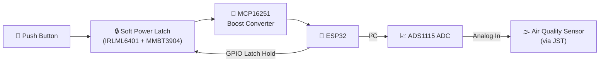

<div align="center">

# 🌿 Battery-Powered ESP32 Air Quality Monitor
### *with Soft Power Latch, Boost Converter & 16-bit ADC*


**A compact, low-power IoT air quality node — power-latched, boost-regulated, and ADC-accurate.**

</div>

---

## ✨ Overview

This project implements a **battery-powered air quality monitoring system** built around the **ESP32**, engineered for long-duration, low-standby-power IoT deployment. A **soft power latch** lets a single push of a button wake the whole board, while the **ESP32 firmware decides when to shut everything back down** — driving standby current to near zero between readings.

> 🔋 Designed for real-world battery life. Simulated and validated end-to-end in **eSim**, as part of the **FOSSEE Research Migration Project**, IIT Bombay.

---

## 🧩 Key Building Blocks

| 🔧 Component | 🎯 Role |
|---|---|
| ⚡ **IRLML6401 + MMBT3904 Soft Power Latch** | Push-button power-on, firmware-controlled power-off — kills standby drain |
| 🔺 **MCP16251 Boost Converter** | Steps up battery voltage to a clean, regulated supply rail |
| 🧠 **ESP32 Dev Board** | Main controller — manages latch hold, sensing, and I²C comms |
| 📈 **ADS1115 16-bit ADC** | High-resolution analog-to-digital conversion over I²C |
| 🔌 **JST Connector** | Plug-and-play interface for an external air-quality sensor |
| 🧱 Passives (R, C, L, D) | Support the boost converter & latch stages |

---

## 🖼️ Gallery

<div align="center">

### 🧊 3D PCB Preview


<br/><br/>

### 🧠 Schematic Design


<br/><br/>

### 🎨 PCB Layout — Front Copper


### 🌐 PCB Layout — Back Copper


</div>

---

## ⚙️ How It Works



1. **Power On** → Button press pulls the MOSFET gate low, connecting the battery to the boost converter.
2. **Latch Hold** → ESP32 immediately asserts a GPIO to keep power on, independent of the button.
3. **Regulate** → MCP16251 boosts the battery voltage to a stable rail for ESP32 & peripherals.
4. **Sense** → ADS1115 digitizes the analog sensor signal and streams data over I²C.
5. **Power Off** → ESP32 releases the latch signal on shutdown, cutting battery current to near-zero.

---

## 📁 Repository Contents

```
📦 esp32-air-quality-monitor
 ┣ 📂 images/                 → PCB renders, layout & schematic screenshots
 ┣ 📂 esim/                   → eSim schematic & simulation project files
 ┣ 📂 kicad/                  → KiCad schematic + PCB layout files
 ┣ 📄 README.md                → You are here 👋
 ┗ 📄 Synopsis.docx / .pdf     → FOSSEE Research Migration Project synopsis
```

---

## 📊 Expected Simulation Results

| Condition | Expected Output |
|---|---|
| Battery = **3.7 V** | Regulated Boost Output ≈ **5.0 V** |
| Sensor Input = **1.65 V** | ADS1115 Output ≈ **Mid-scale digital code** |
| Latch Released | Battery draw → **≈ 0 mA** (standby) |

---

## 📚 Reference

> **AQuality32: A low-cost, open-source air quality monitoring device leveraging the ESP32 and google platform**
> Daniel M. Pineda-Tobón, Albeiro Espinosa-Bedoya, Jhon W. Branch-Bedoya — *HardwareX*, Vol. 21, Article e00607 (2024)
> 🔗 [ScienceDirect / HardwareX](https://doi.org/10.1016/j.ohx.2024.e00607)

---

## 🙌 Credits

<div align="center">

Built by **Haridharan D**
Department of Electronics Engineering (VLSI Design & Technology)
Chennai Institute of Technology, Chennai, Tamil Nadu, India

🔬 Part of the **FOSSEE Research Migration Project**, IIT Bombay
🌐 [esim.fossee.in/research-migration-project](https://esim.fossee.in/research-migration-project)


</div>
